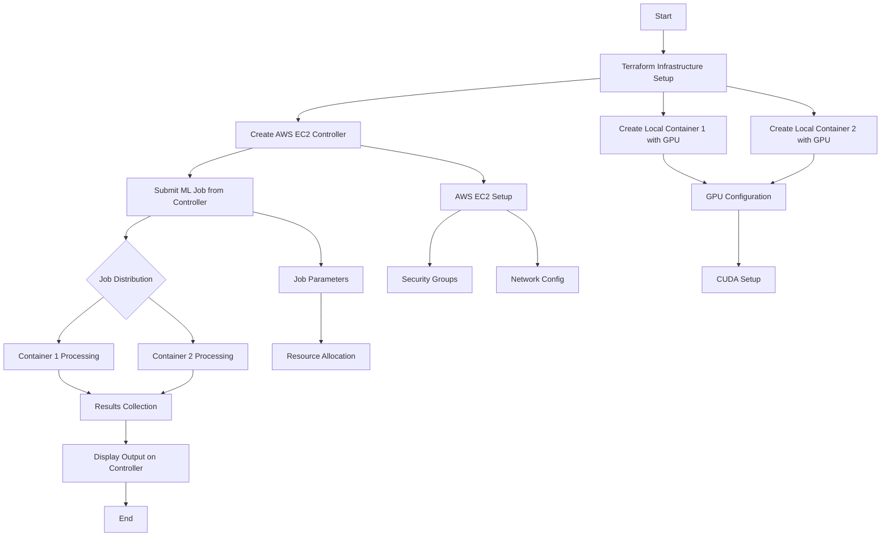
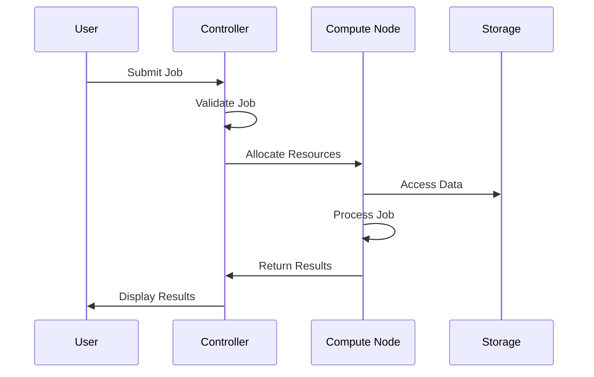

# HPC-Stack: A Slurm-Powered Cloud HPC Solution with GPU Support on Local Machines  

## Introduction  
This project sets up a flexible and cost-effective High-Performance Computing (HPC) cluster using Slurm in Docker containers. The Slurm controller runs on the cloud, while GPU workloads are handled by local on-premises machines. With AWS and Grafana, it ensures efficient resource management and real-time monitoring.  

## Key Objectives  
- **Easy Deployment:** Quickly set up an HPC cluster with containerized Slurm.  
- **Scalability:** Add compute nodes as needed for better performance.  
- **Hybrid Flexibility:** Use the cloud for Slurm management and local machines for GPU processing.  
- **Cost-Effective:** Designed for research and education with minimal costs.  
- **Real-Time Monitoring:** Track resource usage and performance with Grafana.  

## Tech Stack  
- **Orchestration & Monitoring:** Docker, Grafana, Prometheus  
- **HPC Scheduler:** Slurm Workload Manager  
- **Cloud Services:** AWS EC2, VPC  
- **Database:** MySQL (for resource tracking and job management)  
- **Networking:** AWS VPC, Security Groups for secure access  

# Maintaining a structured record of project execution

## 1) AWS VPC and Networking Setup

### Creating a VPC

To establish a secure and isolated network environment, a Virtual Private Cloud (VPC) is created. A VPC allows users to define their own IP address ranges, subnets, and security configurations.

- **VPC Name**: SLURM-VPC
- **CIDR Block**: 10.0.0.0/16
- A VPC ensures a controlled and secure networking environment by isolating resources from other AWS customers.


### Configuring Subnets

#### Private Subnet (For Controller)

- **Name**: PrivateSubnet
- **CIDR**: 10.0.1.0/24
- **Public IP**: Disabled
- The controller node must remain isolated to prevent unauthorized external access and enhance security.

#### Public Subnet (For Bastion Host)

- **Name**: PublicSubnet
- **CIDR**: 10.0.2.0/24
- **Public IP**: Enabled
- The Bastion Host needs public access to serve as a secure gateway to private resources.


### Attaching an Internet Gateway

An Internet Gateway (IGW) is attached to allow external communication for public instances.

- **Gateway Name**: SLURM-IGW
- **VPC Attachment**: SLURM-VPC
- Required for public-facing instances to communicate with the internet.


### Route Table Configuration

#### Public Route Table

- **Name**: Public-RT
- **Association**: PublicSubnet
- **Routes**:
  - `0.0.0.0/0` -> Internet Gateway (SLURM-IGW)
- Ensures that instances in the public subnet can access the internet.


#### Private Route Table

A NAT Gateway is required for controlled internet access in private subnets.

- **Subnet**: PublicSubnet
- **Elastic IP**: Assigned
- **Routes**:
  - `0.0.0.0/0` -> NAT Gateway (SLURM-NAT)
- Allows private instances to access updates and external resources while preventing unsolicited inbound traffic.


### Why an Elastic IP for NAT Gateway?

- Provides a static public IP
- Ensures stable internet access for private instances
- Prevents IP changes on restart
- Supports failover scenarios
- Ensures that private instances maintain a consistent outbound communication channel.


### Launching AWS Instances

#### Controller Node (Private Subnet)

- **Instance Type**: `t3.medium` or `t3.large`
- **Subnet**: PrivateSubnet
- **Security Group**:
  - SSH access only from Bastion Host (`10.0.0.x/24`)
  - SLURM Ports (`6817-6819`) open for compute nodes
- **Storage**: 20GB SSD
- The controller node manages the SLURM cluster and requires controlled access for cluster operations.

#### Bastion Host (Public Subnet)

- **Instance Type**: `t2.micro`
- **Subnet**: PublicSubnet
- **Security Group**:
  - SSH access limited to a trusted IP range
- **Storage**: 8GB SSD
- The Bastion Host provides a secure method to access private instances, reducing exposure to external threats.


### Connecting to Instances

#### Accessing the Bastion Host

```bash
ssh -i Bastion.pem ubuntu@13.232.198.24
```

- Direct access to private instances is not allowed, so the Bastion Host acts as an intermediary.


#### Connecting to the Controller via Bastion

```bash
ssh -i Controller.pem ubuntu@10.0.1.211
```


- Secure access to the controller node is only allowed through the Bastion Host to prevent direct exposure.

#### Checking Internet Access on Private Subnet's Controller to Install Slurm


# Automating above manual infrastructure using terraform
## Creating IAM User with Administrator Access

Follow these steps to create an IAM user with administrator access and generate credentials:

## Step 1: Access IAM Console

1. Sign in to AWS Management Console
2. Navigate to IAM (Identity and Access Management) service

## Step 2: Create New User

1. Click on "Users" in the left navigation pane
2. Click "Add users" button
3. Enter a username for the new IAM user
4. Select "Provide user access to the AWS Management Console" if console access is needed
5. Choose password options (auto-generated or custom)

## Step 3: Set Permissions

1. On the permissions page, select "Attach policies directly"
2. Search for and select "AdministratorAccess" policy
3. Review and confirm the selection

## Step 4: Generate Access Keys

1. After user creation, go to the user's security credentials tab
2. Scroll to "Access keys" section
3. Click "Create access key"
4. Select use case (usually "Command Line Interface (CLI)")
5. Acknowledge the recommendations and proceed
6. Download or copy the credentials (Access key ID and Secret access key)

**Important:** Store the access key ID and secret access key securely. The secret access key cannot be retrieved after initial creation.

## Best Practices

- Enable MFA (Multi-Factor Authentication) for additional security
- Regularly rotate access keys
- Follow the principle of least privilege when assigning permissions
- Monitor user activity through AWS CloudTrail

## Project Flow Diagram



## Sequence Diagram



## Component Details

- **Controller (AWS EC2):** Manages job submission and result collection
- **Local Containers:** GPU-enabled environments for ML computation
- **Terraform:** Infrastructure as Code for automated setup
- **Job Flow:** Controller → Compute Nodes → Results → Controller

## Terraform Configuration for controller

```jsx
terraform {
  required_providers {
    aws = {
      source  = "hashicorp/aws"
      version = "~> 5.0"
    }
  }
}

provider "aws" {
  region     = "ap-south-1"
  access_key = ""
  secret_key = ""
}

resource "aws_vpc" "slurm_vpc" {
  cidr_block = "10.0.0.0/16"
  tags = {
    Name = "SLURM-VPC"
  }
}

resource "aws_subnet" "public_subnet" {
  vpc_id                  = aws_vpc.slurm_vpc.id
  cidr_block              = "10.0.2.0/24"
  map_public_ip_on_launch = true
  availability_zone       = "ap-south-1a"
  tags = {
    Name = "PublicSubnet"
  }
}

resource "aws_subnet" "private_subnet" {
  vpc_id            = aws_vpc.slurm_vpc.id
  cidr_block        = "10.0.1.0/24"
  availability_zone = "ap-south-1a"
  tags = {
    Name = "PrivateSubnet"
  }
}

resource "aws_internet_gateway" "slurm_igw" {
  vpc_id = aws_vpc.slurm_vpc.id
  tags = {
    Name = "SLURM-IGW"
  }
}

resource "aws_route_table" "public_rt" {
  vpc_id = aws_vpc.slurm_vpc.id
  tags = {
    Name = "Public-RT"
  }
}

resource "aws_route" "public_internet_access" {
  route_table_id         = aws_route_table.public_rt.id
  destination_cidr_block = "0.0.0.0/0"
  gateway_id             = aws_internet_gateway.slurm_igw.id
}

resource "aws_route_table_association" "public_assoc" {
  subnet_id      = aws_subnet.public_subnet.id
  route_table_id = aws_route_table.public_rt.id
}

resource "aws_instance" "bastion_host" {
  ami             = "ami-00bb6a80f01f03502"
  instance_type   = "t2.micro"
  subnet_id       = aws_subnet.public_subnet.id
  security_groups = [aws_security_group.controller_sg.name]
  key_name        = aws_key_pair.key_pair.key_name
  tags = {
    Name = "Bastion-Host"
  }
}

resource "aws_instance" "controller" {
  ami             = "ami-00bb6a80f01f03502"
  instance_type   = "t3.medium"
  subnet_id       = aws_subnet.private_subnet.id
  security_groups = [aws_security_group.controller_sg.name]
  key_name        = aws_key_pair.key_pair.key_name
  tags = {
    Name = "SLURM-Controller"
  }
}
```

**Note:** Remember to replace the access_key and secret_key with your own AWS credentials, and ensure they are stored securely. It's recommended to use environment variables or AWS credentials file instead of hardcoding them.

### Key Components:

- **Provider Configuration:** Sets up AWS provider with region and authentication
- **Key Pair Generation:** Creates RSA key pair for EC2 instance access
- **EC2 Instance:** Deploys t2.micro instance with Ubuntu AMI
- **Local File:** Saves private key for SSH access

## Accessing EC2 Instance via CLI

To access your EC2 instance using the PEM file, follow these steps:

1. First, change the permissions of your PEM file to make it secure:
`chmod 400 your-key-name.pem`
2. Use SSH to connect to your EC2 instance:
`ssh -i your-key-name.pem ubuntu@your-instance-public-ip`

For example, using the instance from our configuration:

```bash
chmod 400 controller-key.pem
ssh -i controller-key.pem ubuntu@13.233.71.90
```

**Note:** Replace 'your-key-name.pem' with your actual key file name and 'your-instance-public-ip' with your EC2 instance's public IP address.

## Terraform Configuration for Compute Nodes

```jsx
terraform {
  required_providers {
    docker = {
      source  = "kreuzwerker/docker"
      version = "~> 3.0.1"
    }
  }
}

provider "docker" {}

# Create a Docker network for SLURM communication
resource "docker_network" "slurm_network" {
  name = "slurm_network"
}

# Pull Ubuntu Docker image
resource "docker_image" "ubuntu" {
  name         = "ubuntu:latest"
  keep_locally = false
}

# Compute Node 1
resource "docker_container" "compute1" {
  name  = "compute1"
  image = docker_image.ubuntu.name
  networks_advanced {
    name = docker_network.slurm_network.name
  }
  hostname = "compute1"

  # Configure SSH and enable root login
  command = [
    "bash", "-c",
    "apt-get update && apt-get install -y openssh-server && echo 'root:root' | chpasswd && echo 'PermitRootLogin yes' >> /etc/ssh/sshd_config && echo 'PasswordAuthentication yes' >> /etc/ssh/sshd_config && mkdir -p /run/sshd && /usr/sbin/sshd -D"
  ]

  ports {
    internal = 22
    external = 2222
  }
}

# Compute Node 2
resource "docker_container" "compute2" {
  name  = "compute2"
  image = docker_image.ubuntu.name
  networks_advanced {
    name = docker_network.slurm_network.name
  }
  hostname = "compute2"

  # Configure SSH and enable root login
  command = [
    "bash", "-c",
    "apt-get update && apt-get install -y openssh-server && echo 'root:root' | chpasswd && echo 'PermitRootLogin yes' >> /etc/ssh/sshd_config && echo 'PasswordAuthentication yes' >> /etc/ssh/sshd_config && mkdir -p /run/sshd && /usr/sbin/sshd -D"
  ]

  ports {
    internal = 22
    external = 2223
  }
}
```

### Key Components:

- **Docker Provider:** Sets up Docker provider for container management
- **Network Creation:** Creates a dedicated network for SLURM communication
- **Compute Nodes:** Deploys two Ubuntu-based containers with SSH access
- **Port Mapping:** Maps container ports to host system for SSH access

**Note:** Ensure Docker is installed and running on the local system before applying this configuration.

## Accessing Compute Nodes in Containers

To access the compute nodes running in Docker containers, use these SSH commands:

```bash
# Access compute node 1
ssh root@localhost -p 2222

# Access compute node 2
ssh root@localhost -p 2223
```

Default credentials:

- **Username:** root
- **Password:** root

Alternative method using Docker commands:

```bash
# Direct access to compute node 1
docker exec -it compute1 bash

# Direct access to compute node 2
docker exec -it compute2 bash
```

**Note:** Make sure the containers are running before attempting to connect. You can check their status with:

```bash
docker ps
```

## Installing NVIDIA Docker Toolkit

Follow these steps to install NVIDIA Docker Toolkit and enable GPU support in containers:

1. Add NVIDIA package repositories:
`distribution=$(. /etc/os-release;echo $ID$VERSION_ID)
curl -s -L https://nvidia.github.io/nvidia-docker/gpgkey | sudo apt-key add -
curl -s -L https://nvidia.github.io/nvidia-docker/$distribution/nvidia-docker.list | sudo tee /etc/apt/sources.list.d/nvidia-docker.list`
2. Update package list and install NVIDIA Docker Toolkit:
`sudo apt-get update
sudo apt-get install -y nvidia-docker2`
3. Restart Docker daemon:
`sudo systemctl restart docker`

To use NVIDIA GPUs in your containers, modify your Docker container configuration:

```jsx
resource "docker_container" "compute1" {
  # ... existing configuration ...
  
  runtime = "nvidia"
  
  devices {
    name = "nvidia.com/gpu=all"
  }
  
  env = [
    "NVIDIA_VISIBLE_DEVICES=all",
    "NVIDIA_DRIVER_CAPABILITIES=compute,utility"
  ]
}
```

**Note:** Ensure NVIDIA drivers are properly installed on the host system before attempting to use GPUs in containers.

To verify GPU access, you can run:

```bash
docker run --rm --gpus all nvidia/cuda:11.0-base nvidia-smi
```

## Generating SSH Keys on Local Machine

Follow these steps to generate SSH keys on your local machine:

1. Open a terminal on your local machine
2. Run the command: `ssh-keygen -t rsa -b 4096`
3. When prompted, press Enter to accept the default file location (~/.ssh/id_rsa)
4. Optionally enter a passphrase when prompted (recommended for security)
5. The system will generate two files: 
    - id_rsa (private key)
    - id_rsa.pub (public key)
6. View your public key with: `cat ~/.ssh/id_rsa.pub`

**Important:** Keep your private key secure and never share it. The public key can be shared and added to remote systems for authentication.

## Reverse SSH Port Forwarding

To establish a reverse SSH tunnel for remote access, use the following command:

```bash
ssh -R 22:localhost:22 -R 6818:localhost:6818 -R 7003:localhost:7003 ubuntu@13.233.71.90
```

This command creates three reverse tunnels:

- **Port 22:** For SSH access (localhost:22 → remote:22)
- **Port 6818:** For SLURM communication (localhost:6818 → remote:6818)
- **Port 7003:** For additional services (localhost:7003 → remote:7003)

**Note:** Ensure the ports are open in your security groups and firewall settings on both ends.

To make the connection more stable, you can add these SSH options:

```bash
ssh -R 22:localhost:22 -R 6818:localhost:6818 -R 7003:localhost:7003 -o ServerAliveInterval=60 -o ServerAliveCountMax=3 ubuntu@13.233.71.90
```

## SSH Configuration for Easy Access

Create or edit your SSH config file to simplify connections:

### 1. Controller Configuration

```bash
nano ~/.ssh/config

Host controller
    HostName 13.233.71.90
    User ubuntu
    IdentityFile ~/controller-key.pem
```

### 2. Compute Nodes Configuration

```bash
nano ~/.ssh/config
Host compute1
    HostName localhost
    User root
    Port 2222

Host compute2
    HostName localhost
    User root
    Port 2223
```

After setting up this configuration, you can simply use:

- `ssh controller` - to connect to the controller node
- `ssh compute1` - to connect to compute node 1
- `ssh compute2` - to connect to compute node 2

**Note:** Make sure to set appropriate permissions on your SSH config file with: `chmod 600 ~/.ssh/config`

## Host File Configuration

Add the following entries to the host files on different nodes:

### On Controller Node:

```bash
echo "127.0.0.1 compute1" | sudo tee -a /etc/hosts
echo "127.0.0.1 compute2" | sudo tee -a /etc/hosts
```

### On Controller and Compute Nodes:

```bash
echo "3.109.2.160 controller" | sudo tee -a /etc/hosts
```

### On Compute Nodes:

```bash
echo "172.21.0.2 compute1" | tee -a /etc/hosts
echo "172.21.0.3 compute2" | tee -a /etc/hosts
```

**Note:** These host entries enable proper name resolution between the controller and compute nodes in the cluster.


# Prometheus and Grafana Setup for Cluster Monitoring

## Prometheus Setup

### 1. Install Prometheus
- Download and install Prometheus on the controller node or a dedicated monitoring server.
- Use the following commands to install Prometheus on an Ubuntu-based system:
  
  ```bash
  wget https://github.com/prometheus/prometheus/releases/download/v2.30.3/prometheus-2.30.3.linux-amd64.tar.gz
  tar xvfz prometheus-2.30.3.linux-amd64.tar.gz
  cd prometheus-2.30.3.linux-amd64
  ```

### 2. Configure Prometheus
- Edit the `prometheus.yml` configuration file to define the targets (nodes and containers) to monitor.
- Example configuration:
  
  ```yaml
  global:
    scrape_interval: 15s

  scrape_configs:
    - job_name: 'ec2_instances'
      static_configs:
        - targets: ['<EC2_Instance_IP>:9100']

    - job_name: 'containers'
      static_configs:
        - targets: ['<Container_IP>:9100']
  ```
- Replace `<EC2_Instance_IP>` and `<Container_IP>` with the actual IP addresses of your EC2 instances and containers.

### 3. Start Prometheus
- Start Prometheus with the following command:
  
  ```bash
  ./prometheus --config.file=prometheus.yml
  ```

### 4. Install Node Exporter
- Install the Node Exporter on each EC2 instance and container to collect system metrics.
- Use the following commands to install Node Exporter:
  
  ```bash
  wget https://github.com/prometheus/node_exporter/releases/download/v1.2.2/node_exporter-1.2.2.linux-amd64.tar.gz
  tar xvfz node_exporter-1.2.2.linux-amd64.tar.gz
  cd node_exporter-1.2.2.linux-amd64
  ./node_exporter
  ```

---

## Grafana Setup

### 1. Install Grafana
- Download and install Grafana on the same server as Prometheus or a separate monitoring server.
- Use the following commands to install Grafana on an Ubuntu-based system:
  
  ```bash
  sudo apt-get install -y adduser libfontconfig1
  wget https://dl.grafana.com/oss/release/grafana_8.1.5_amd64.deb
  sudo dpkg -i grafana_8.1.5_amd64.deb
  sudo systemctl start grafana-server
  sudo systemctl enable grafana-server
  ```

### 2. Access Grafana
- Open a web browser and navigate to `http://<Grafana_Server_IP>:3000`.
- Log in with the default username `admin` and password `admin`. Change the password after the first login.

### 3. Add Prometheus as a Data Source
- In Grafana, go to `Configuration` > `Data Sources`.
- Click `Add data source` and select `Prometheus`.
- Set the URL to `http://<Prometheus_Server_IP>:9090`.
- Click `Save & Test` to ensure the connection is successful.

### 4. Create Dashboards
- Go to `Create` > `Dashboard` and add panels to visualize the metrics collected by Prometheus.
- Use queries to display metrics such as CPU usage, memory usage, network traffic, and GPU utilization.
- Example query for CPU usage:
  
  ```promql
  100 - (avg by (instance) (irate(node_cpu_seconds_total{mode="idle"}[1m])) * 100)
  ```

---

## Monitoring GPU Metrics

### 1. Install NVIDIA DCGM Exporter
- On GPU-enabled containers, install the NVIDIA DCGM Exporter to collect GPU metrics.
- Use the following commands to install DCGM Exporter:
  
  ```bash
  docker run -d --gpus all --rm -p 9400:9400 nvcr.io/nvidia/k8s/dcgm-exporter:2.1.4-2.6.11-ubuntu20.04
  ```

### 2. Configure Prometheus to Scrape GPU Metrics
- Add a new job in `prometheus.yml` to scrape metrics from the DCGM Exporter.
- Example configuration:
  
  ```yaml
  - job_name: 'gpu_metrics'
    static_configs:
      - targets: ['<GPU_Container_IP>:9400']
  ```

### 3. Visualize GPU Metrics in Grafana
- Create new panels in Grafana to display GPU metrics such as utilization, temperature, and memory usage.
- Example query for GPU utilization:
  
  ```promql
  nvidia_gpu_duty_cycle
  ```

---

